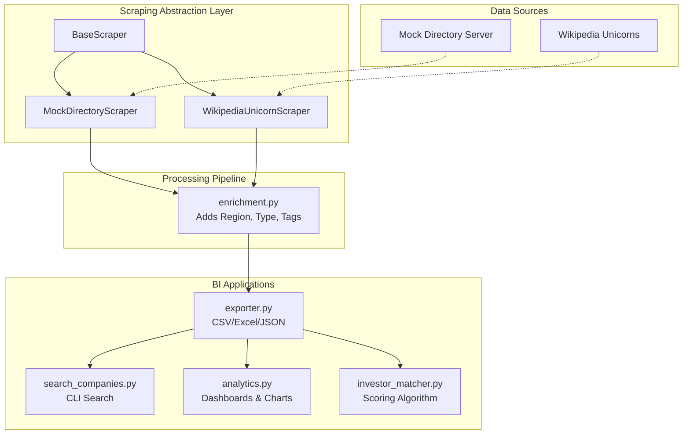

# web_scrapper
# Startup & Manufacturer Business Intelligence Engine

An enterprise-grade, portfolio-ready data engineering platform that transforms unstructured directory data into structured Business Intelligence.

This platform serves as the first data acquisition layer for matching investors, startups, and manufacturers, turning web data into actionable market insights.

## System Architecture



## Features & Business Use Cases

### 1. Extensible Scraping Architecture (Phase 1)
- **Object-Oriented Design**: A `BaseScraper` handles resilient sessions, exponential backoffs, and logging.
- **Pluggable Sources**: Easily switch between `MOCK` (local server) and `WIKIPEDIA` (live list of Unicorns) via `config.py`.

### 2. Data Enrichment (Phase 2)
Raw HTML elements are parsed and enriched into a master dataset. The pipeline automatically classifies:
- **Company Type**: Determines if a listing is a Startup or Manufacturer based on industry heuristics.
- **Geographic Region**: Maps cities/countries into major economic zones (North America, Europe, Asia).
- **Technology Tags**: Auto-tags companies with labels like `AI`, `Robotics`, `FinTech`, `IoT`, or `SaaS`.

### 3. Business Intelligence Applications (Phases 3-5)
- **Search Engine**: `python search_companies.py --industry "AI" --location "Europe"`
- **Analytics Dashboard**: `python analytics.py` generates distribution charts of market data in the `reports/` folder.
- **Investor Matcher**: `python investor_matcher.py` demonstrates a weighted scoring algorithm connecting hypothetical investors to optimal startup matches based on Focus Tags, Region, and Company Type.

### 4. Robust Export System (Phase 6)
Data flows into the `exports/` directory in three formats, ready for any downstream system:
- **CSV**: For database ingestion.
- **Excel (.xlsx)**: For business analysts.
- **JSON**: For API endpoints or NoSQL databases.

## Installation & Setup

1. Create a virtual environment:
   ```bash
   python -m venv venv
   # Windows:
   venv\Scripts\activate
   # macOS/Linux:
   source venv/bin/activate
   ```
2. Install dependencies:
   ```bash
   pip install -r requirements.txt
   ```

## Demo Workflow

### 1. Start the Local Directory Server (if using MOCK data)
```bash
python server.py
```
*(Leave this running in a separate terminal)*

### 2. Run the Data Pipeline
```bash
python scraper.py
```
This triggers:
1. Scraper Execution
2. Data Enrichment
3. Master Dataset Export (CSV, Excel, JSON)

### 3. Generate Analytics
```bash
python analytics.py
```
Check the `reports/` folder for generated charts (Region Distribution, Type Distribution, Category Distribution).

### 4. Run the Search Engine
```bash
python search_companies.py --tags AI --type Startup
```

### 5. Run Investor Matching
```bash
python investor_matcher.py
```
